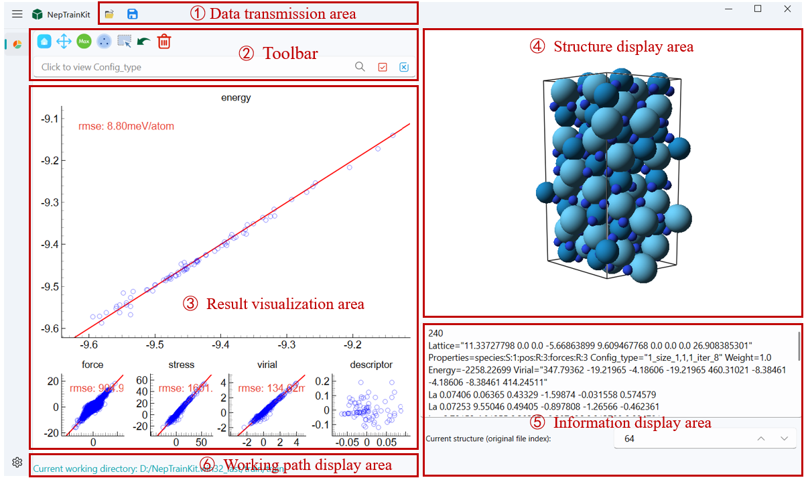
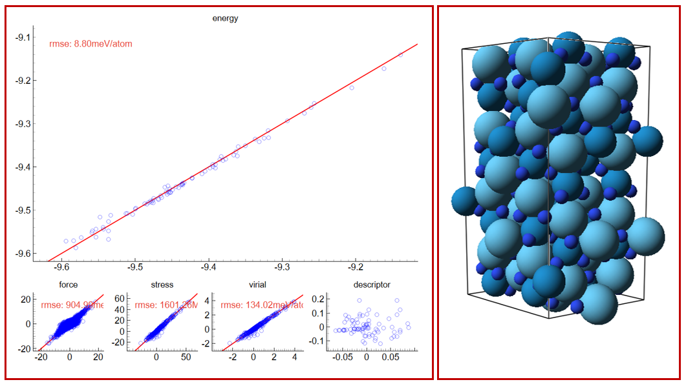
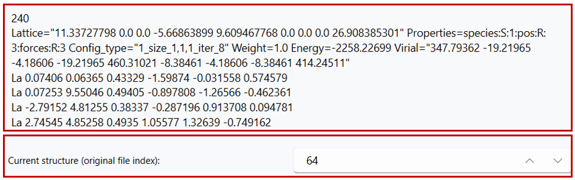

# NEP Dataset Display

## 1.User Interface

As shown in the figure, the overall user interface of the software primarily includes the toolbar, result visualization area, structure display area, information display area, and working path display area.

## 2.Data transmission area

### Data Import

Users can import files in the following two ways:

- Click the import button located at the top left of the menu  to import the file path.
- Drag and drop the file directly into the software interface for import.
:::{important}
- Please ensure that the working path of NepTrainkit does not contain any Chinese characters, as this may prevent the program from displaying correctly.
- To ensure proper use of NepTrainkit, at least two files, **nep.txt** and **train.xyz**, must be provided.
:::
### Data Export

After completing the operation, the user can click the save button 
to export the results as two files:

- **export_remove_model.xyz**: Contains information about the deleted structures.
- **export_good_model.xyz**: Contains information about the remaining structures.

## 3.Toolbar

In the drawing toolbar, we have integrated function buttons such as reset, zoom, selection and editing, undo, and delete. Users can perform basic operations on the image using these tools. Please note that these operation tools are only effective on the main chart.

 **Reset Tool:** Restores the image to its initial state, clearing all modifications made.

 **Zoom Tool:** Allows users to drag the image's axes or zoom in/out to adjust the view position.

 **Error Max Point Selection Tool:** Automatically identifies a specified number of points with the largest errors, making it easier for users to process them.

 **Farthest Point Sampling Tool:** Users can set the maximum number of training samples and the minimum sampling distance to filter structures.

 **Selection and Editing Tool:** Use the left mouse button to draw a selection box or directly select a structure; right-click to deselect.

 **Undo Tool:** If a structure is accidentally deleted or modified, the undo function can restore the previous state. It supports multiple consecutive undo actions.

 **Delete Tool:** Removes the structure corresponding to the selected point.

 **Search Tool:** Allows you to select a single **Config_type** and search for specific prefixes, suffixes, or strings.

:::{important}
After clicking the search button, the relevant structures will turn green to indicate the search results. However, at this point, the structures will not be selected. You will need to perform additional actions to complete the selection.
:::

 **Select Button:** Selects the structures found by the search.

 **Deselect Button:** Deselects the selected structures.

:::{important}
If there are no **Config_type** available, clicking the **Select** button will select all visible items, and clicking the **Deselect** button will deselect all items.
:::
## 4.Result Visualization and Structure Display

- The result visualization area consists of five subplots, displaying the descriptors, energy, force, pressure, and potential energy information of the dataset. We use the **pyqtgraph** library to encapsulate the plotting functions, and all five subplots support switching to the main plot by double-clicking.
- By clicking on a data point in the main plot, the corresponding crystal structure will be displayed in the right-side display area. The atom sizes and colors in the crystal structure are set based on the atomic radius and the CPK color scheme, respectively.

**Plotting Details:** During the plotting process, **energy**, **force**, **pressure**, and **potential energy** data are all read from the NEP output files in the working path. For **descriptor projection**, we use NEP_CPU to obtain the descriptor of each atom and compute its average as the structure descriptor. Then, principal component analysis (PCA) is used to project the structure descriptors into a two-dimensional space for easier visualization.

## 5.Information Display Area

- In the information display area on the right, the system will show detailed information about the selected **xyz file**. By default, when you click on any data point in the subplots, the display area on the right will synchronize and show the detailed information of the selected structure.
- Below the display area, the **frame number** of the current structure in the original file will be shown. Users can adjust the frame number to view the corresponding structure and its detailed information.

