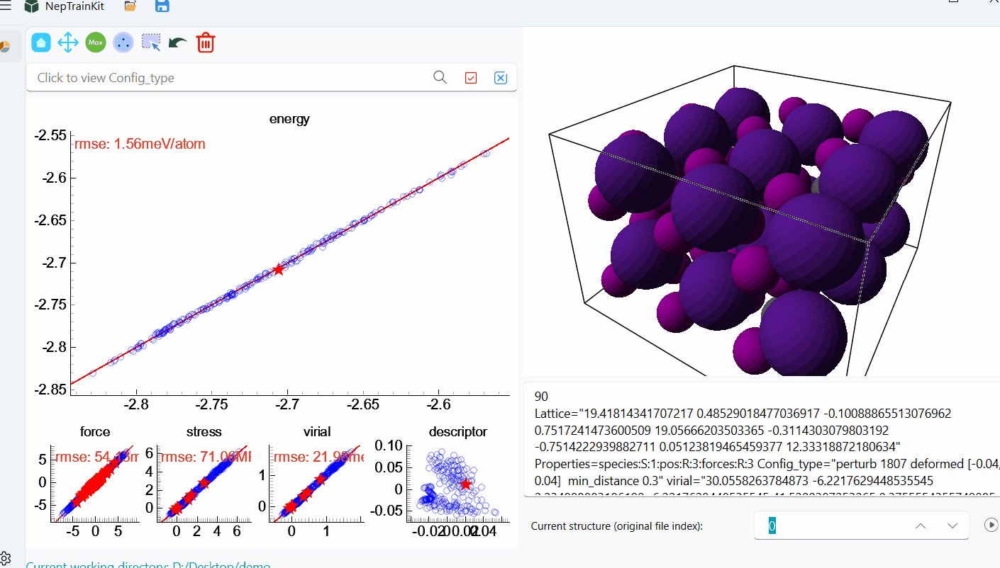
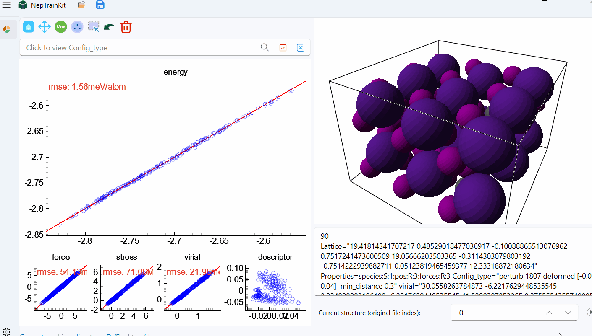

# NEP Display

## Data Import
In this section, we will use only the `nep.txt` and `train.xyz` files. You can simply drag any file into the software window to load it.

Once loaded, the interface will appear as shown below, with red stars indicating the position of the structure in the training set.  

## Trajectory Playback
Next, let's introduce the trajectory playback feature. On the right side of the structure index space (SpinBox), there is a play button:  
. When clicked, it will play the trajectory frame by frame as a preview feature.

## Dataset Editing
Now, let's demonstrate how to edit and filter the training set.

:::{note}
- The training set is limited in size, and each toolset is built based on the original data, allowing continuous operations.
- The following operations are for demonstration purposes and are performed on the energy plot.
:::

### Maximum Error Point Selection
First, we select and delete the top 10 points based on the maximum energy error.  

### Sparse Sampling of Furthest Points
This training set contains about 200 structures. We set the minimum distance to 0.01 and retain a maximum of 100 structures.  

### Manual Selection
Next, we'll demonstrate how to manually select and deselect structures.  
:::{note}
- Left-click: Select a structure, either by clicking or drawing a trajectory.
- Right-click: Deselect a structure, either by clicking or drawing a trajectory.
:::

### Config_type Selection
Now, we will demonstrate how to use `Config_type` for selection.  

:::{important}
This tool is typically used in conjunction with the three features mentioned above to more precisely filter the structures.
:::

Below is an example of how `Config_type` can be combined with the sparse sampling of furthest points. Based on the sparse sampling, we retain the AIMD structures.  

## Exporting the Dataset
Finally, after deleting the selected structures, we can export the filtered dataset.  

