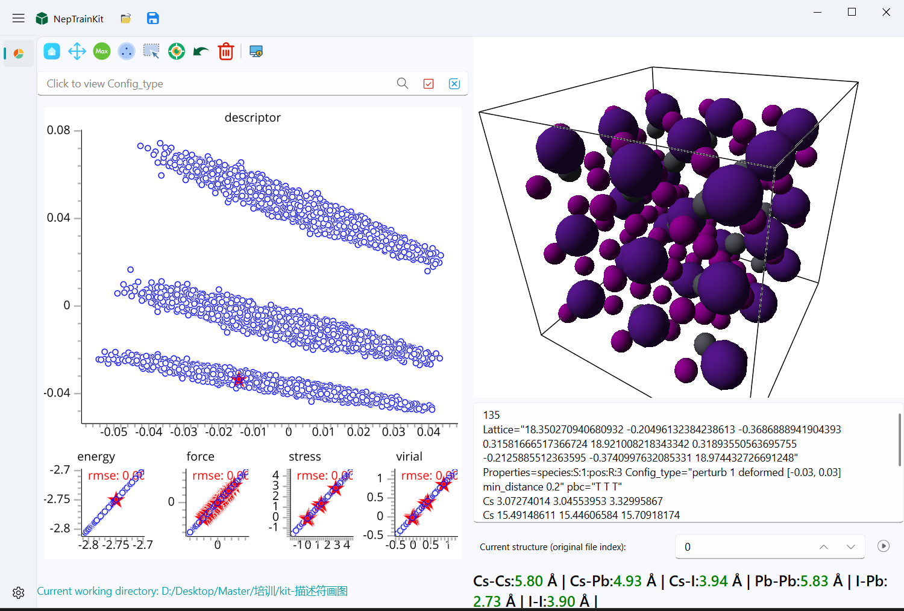
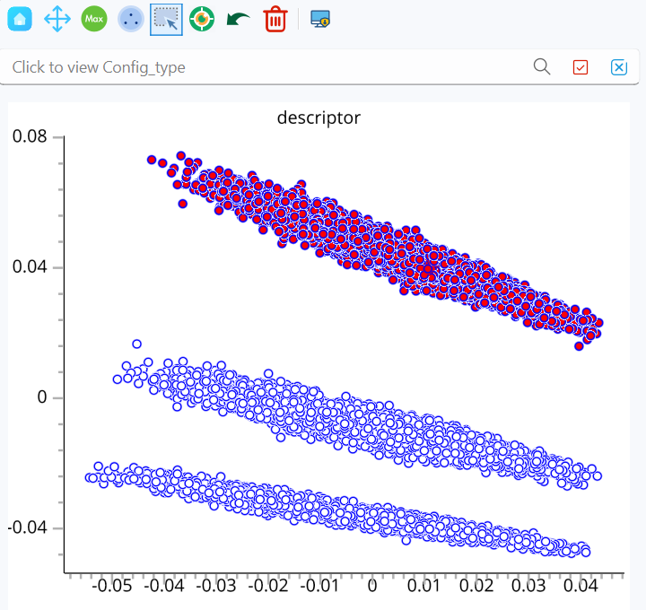
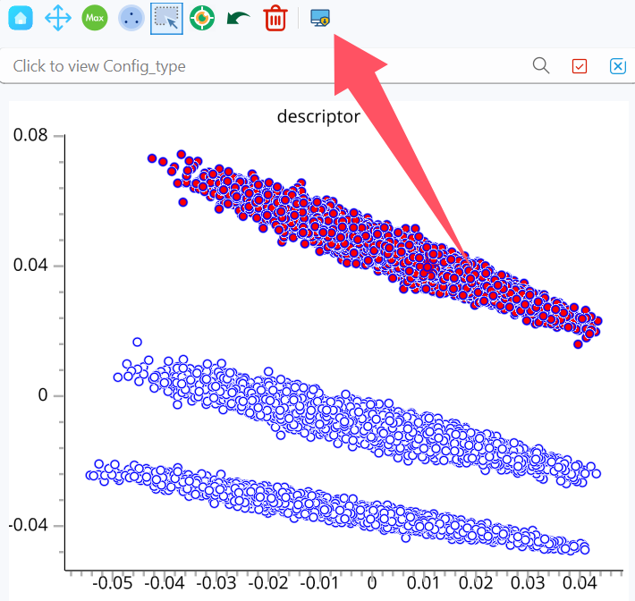
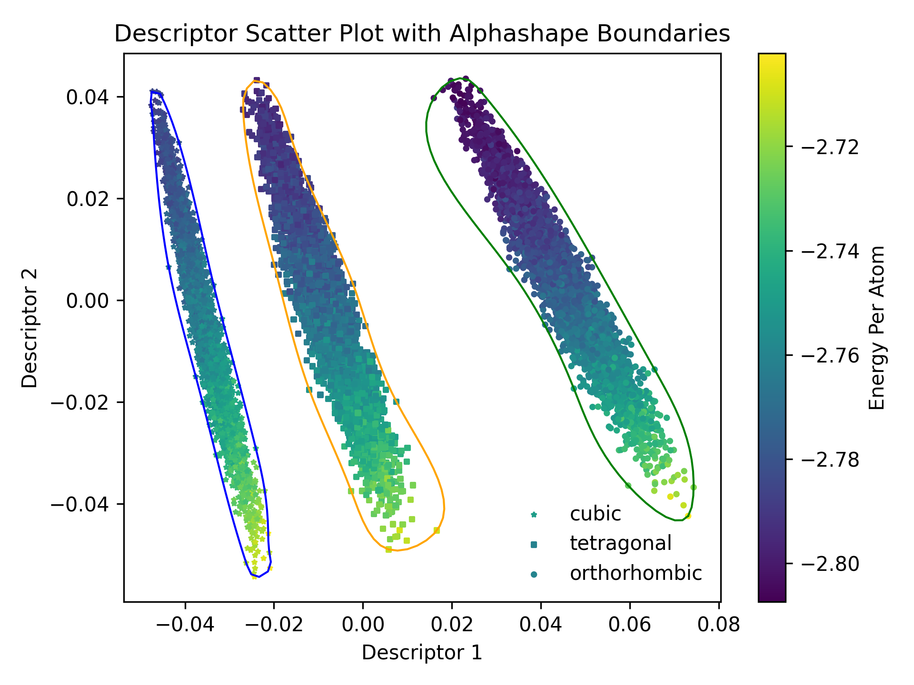

# 绘制描述符分布图
本节将演示如何使用NepTrainKit分割描述符并绘制结构分布图。

## 数据导入
我们以CsPbI3为例进行演示。`train.xyz`文件中包含了正交相、四方相和立方相三种结构。通过PCA降维后，可以清晰地区分出这三个相的结构分布，如下图所示。



## 导出描述符
1. 首先，使用鼠标框选工具选中需要导出的结构。


2. 然后，点击导出描述符按钮。


3. 最后，选择导出文件的路径即可完成导出。


重复上述步骤1-3，最终会得到`cubic_descriptor.out`、`orthorhombic_descriptor.out`和`tetragonal_descriptor.out`三个文件。

## 绘制分布图
我们使用[plot_descriptor.py](https://github.com/aboys-cb/NepTrainKit/blob/master/tools/plot_descriptor.py)脚本来绘制分布图。以下是脚本的部分代码，我们需要修改`config`变量中的路径和`method`变量。

`config`中的文件路径应与导出的文件路径一致。`method`变量用于选择算法，可以选择`'alphashape'`或`'dbscan'`，该算法仅涉及外边框的计算。

```python
method = 'alphashape'

if method == 'alphashape':
    import alphashape
else:
    from sklearn.cluster import DBSCAN
    from scipy.spatial import ConvexHull

start_time = time.time()

config = [
    # (描述符路径, 图例标签, 标记符号)
    ("./cubic_descriptor.out", "cubic", "*"),
    ("./tetragonal_descriptor.out", "tetragonal", "s"),
    ("./orthorhombic_descriptor.out", "orthorhombic", "o")
]
```

修改完成后，执行`python plot_descriptor.py`命令，即可生成结构分布图`descriptor_scatter_plot.png`。

